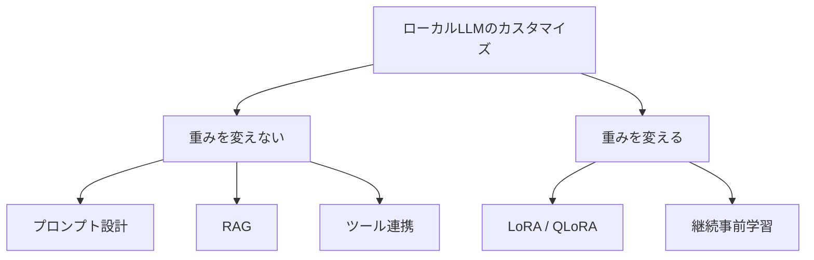
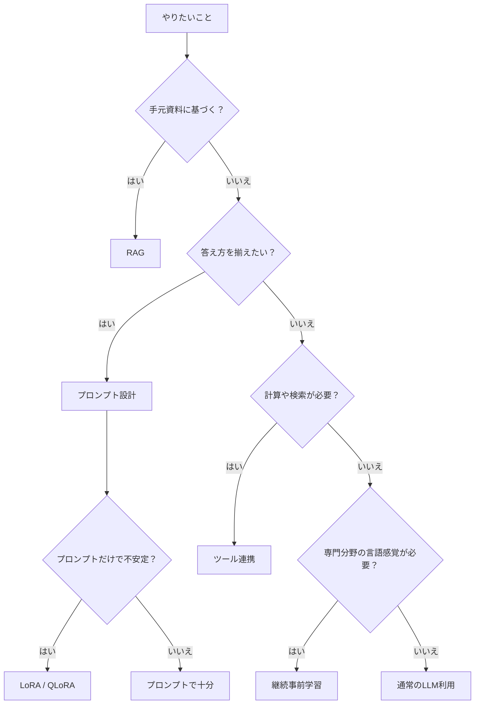

# 第1章 全体像

## この章で学ぶこと

この章では、軽量ローカルLLMをカスタマイズする方法を大きく分類し、それぞれが何を変える方法なのかを整理します。

ローカルLLMを文書作成、コーディング、資料確認で使うとき、重要なのは「どのモデルが一番賢いか」だけではありません。むしろ、何をプロンプトで制御し、何を資料検索で補い、何をツールに任せ、どこから学習が必要になるのかを見分けることが大切です。

## カスタマイズの5分類

軽量ローカルLLMのカスタマイズは、次の5つに分けると理解しやすくなります。

| 方法 | 変える対象 | 得意なこと | 一般的な作業例 |
| --- | --- | --- | --- |
| プロンプト設計 | 指示 | 役割、文体、回答形式 | 文書整理、コメント作成、説明文 |
| RAG | 参照資料 | 手元資料に基づく回答 | 手順書QA、仕様検索、FAQ |
| ツール連携 | 外部機能 | 計算、検索、ファイル処理 | CSV分析、設定確認、ログ整理 |
| LoRA / QLoRA | 一部の重み | 出力形式や判断基準の安定化 | コメント文、分類、定型要約 |
| 継続事前学習 | 言語感覚 | 特定領域の文体や語彙への適応 | 用語集、作業メモ、技術文書 |

## まず大事な区別

カスタマイズには、モデルの重みを変えない方法と、重みを変える方法があります。



最初は、重みを変えない方法から始めるのがよいです。理由は単純で、すぐ試せて、失敗しても戻しやすいからです。

文書やコードを扱う日常作業では、手順書、仕様メモ、作業ログ、FAQなど、更新される資料が多くあります。こうした情報はモデルに覚え込ませるより、RAGで検索して渡す方が管理しやすいです。

## 何をどの方法で扱うか



この図で大事なのは、LoRAや継続事前学習を早く選びすぎないことです。

たとえば「手順書を覚えさせたい」と思った場合、多くはLoRAではなくRAGです。「コメント文の文体をいつも同じにしたい」と思った場合は、まずプロンプト設計、それでも揺れるならLoRAです。

## 代表的な構成

文書作成、コーディング、資料確認の支援として実用的なのは、次の組み合わせです。

```text
ローカルLLM
+ 文書・コード作業用システムプロンプト
+ 手順書・仕様メモ・作業ログのRAG
+ Python・ファイル検索・CSV処理などのツール
```

この構成でできること:

- 手順書に基づく質問応答
- 読者に合わせた説明への言い換え
- 複数文書の比較整理
- 作業アイデアの壁打ち
- データの概要確認
- コメント文の下書き
- FAQの作成

次章から、それぞれの方法を詳しく見ていきます。

