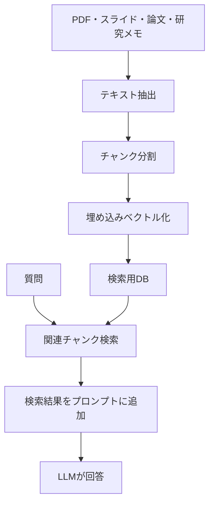

# 第3章 RAG

## この章で学ぶこと

RAGは、Retrieval-Augmented Generationの略です。質問に関係する資料を検索し、その抜粋をLLMに渡して回答させる方法です。

研究・教育用途では、RAGが最も実用的なカスタマイズになることが多いです。授業資料、論文、研究室メモ、実験手順書などをモデルに直接覚えさせるのではなく、必要なときに探して読ませます。

## RAGの基本構造



RAGの本質は、LLMに「知識を覚えさせる」ことではありません。質問に関係する資料を検索し、検索結果を根拠として使わせることです。

## RAGに向いている資料

大学の研究・教育では、次のような資料がRAGに向いています。

- 授業スライド
- シラバス
- 演習問題
- 過去のQ&A
- 論文PDF
- 実験手順書
- ゼミ議事録
- 研究メモ
- LaTeX原稿
- Markdownノート
- 研究室ルール

特に、更新される資料はRAG向きです。モデルに覚え込ませると更新が大変ですが、RAGなら資料を差し替えたり再インデックスしたりするだけで済みます。

## RAGでできること

```text
この授業資料の範囲だけを根拠に、期末試験の記述問題を5問作ってください。
```

```text
この論文群から、未解決課題を3つに整理してください。
```

```text
研究室メモを参照して、この実験条件を使い始めた理由を教えてください。
```

```text
このシラバスと授業資料を参照して、学習者向けFAQを作ってください。
```

## RAGの設計要素

RAGでは、モデルの性能だけでなく、資料処理の品質が重要です。

| 設計要素 | 意味 | 注意点 |
| --- | --- | --- |
| テキスト抽出 | PDFやスライドから文字を取り出す | 図表や数式が崩れやすい |
| チャンク分割 | 文書を小さく分ける | 小さすぎると文脈不足、大きすぎると検索が粗い |
| 埋め込みモデル | 検索用ベクトルを作る | 日本語、英語、専門語に合うか確認する |
| ベクトルDB | 検索用データベース | ChromaやFAISSなど |
| メタデータ | 出典、年度、授業名など | 根拠提示とフィルタに重要 |
| プロンプト | 検索結果の使い方を指定 | 根拠外の推測を抑える |

## チャンク分割の考え方

チャンクとは、検索の単位になる文書片です。

短すぎるチャンクは、検索には引っかかっても文脈が足りません。長すぎるチャンクは、余計な情報が混ざりやすくなります。

授業資料や研究メモでは、最初は次のような単位が扱いやすいです。

- 見出しごと
- スライド数枚ごと
- 段落数個ごと
- 論文の節ごと

RAGは、最初から完璧な分割を目指すより、質問してみて「必要な資料が検索されるか」を確認しながら直す方が進めやすいです。

## 根拠付き回答のプロンプト

RAGでは、回答に出典を出させると運用しやすくなります。

```text
以下の資料抜粋だけを根拠に回答してください。
資料に書かれていないことは推測せず、「資料内では確認できません」と述べてください。
回答の最後に、根拠として使った資料名を列挙してください。
```

この指定は、研究・教育では特に重要です。授業内容や論文内容について、根拠のない補完をされると困るからです。

## RAGとファインチューニングの違い

RAGは、知識を外部資料として参照する方法です。ファインチューニングは、モデルの振る舞いや出力傾向を変える方法です。

授業資料や論文の中身を扱いたいなら、まずRAGです。

講評文や要約形式を安定させたいなら、プロンプト設計やLoRAです。

