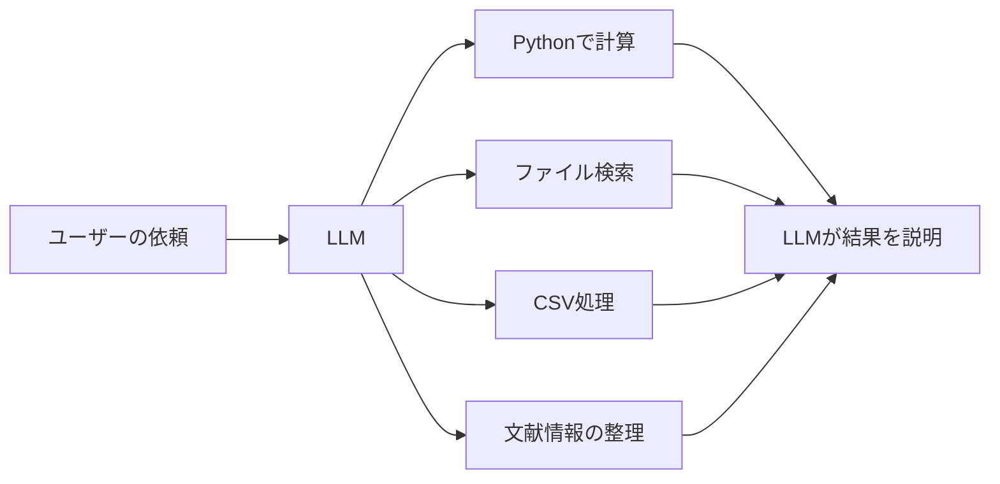

# 第4章 ツール連携

## この章で学ぶこと

ツール連携は、LLMに外部機能を使わせる方法です。

軽量ローカルLLMは、計算、厳密な検索、大量ファイル処理が苦手です。そこで、LLMにすべてを任せるのではなく、Python、ファイル検索、CSV処理、文献管理ツールなどを使わせます。

## ツール連携の基本構造



ポイントは、LLMを「全部を自力で解く存在」と見なさないことです。LLMは作業を分解し、必要な道具を選び、結果を説明する役に向いています。

## 研究・教育で使えるツール連携

### CSVや実験データ

```text
このCSVを読み込み、欠損値、外れ値、平均、標準偏差を確認してください。
数値処理はPythonで行い、最後に教育用にわかりやすく説明してください。
```

LLMに直接計算させるより、Pythonで計算した結果をLLMに解釈させる方が安定します。

### BibTeX整理

できること:

- 重複エントリの検出
- キー名の整形
- 必須項目の不足確認
- journal名の表記ゆれ確認
- 年代順や著者順の整理

### LaTeX原稿の確認

できること:

- 章立ての確認
- 未参照ラベルの検出
- 表記ゆれの探索
- TODOコメントの抽出
- 図表番号や参照の確認

### 授業資料の処理

できること:

- Markdownから小テストを生成
- スライド原稿から復習問題を作成
- 提出ファイル名の規則チェック
- フォルダ内の関連資料検索
- FAQ候補の抽出

## 小さいモデルを賢く使う考え方

軽量モデルは、大きなモデルに比べると推論力で劣る場合があります。しかし、ツールを使わせると実用性が大きく上がります。

役割分担は次のように考えるとよいです。

| 作業 | 担当 |
| --- | --- |
| 方針を考える | LLM |
| 正確な計算 | Python |
| ファイル検索 | 検索ツール |
| 表やCSVの処理 | pandasなど |
| 結果の説明 | LLM |
| 最終判断 | 人間 |

## ツール連携の注意点

ツールを使えるLLMは便利ですが、実行権限には注意が必要です。

特に注意すること:

- 学生情報を含むファイルを不用意に処理しない
- 削除や上書きを自動実行させない
- 外部APIに未公開データを送らない
- 実験データの処理履歴を残す
- 重要な結果は人間が再確認する

ローカル環境でも、ログや中間ファイルに情報が残ることがあります。研究データや成績情報を扱う場合は、保存場所とアクセス権限を確認してください。

