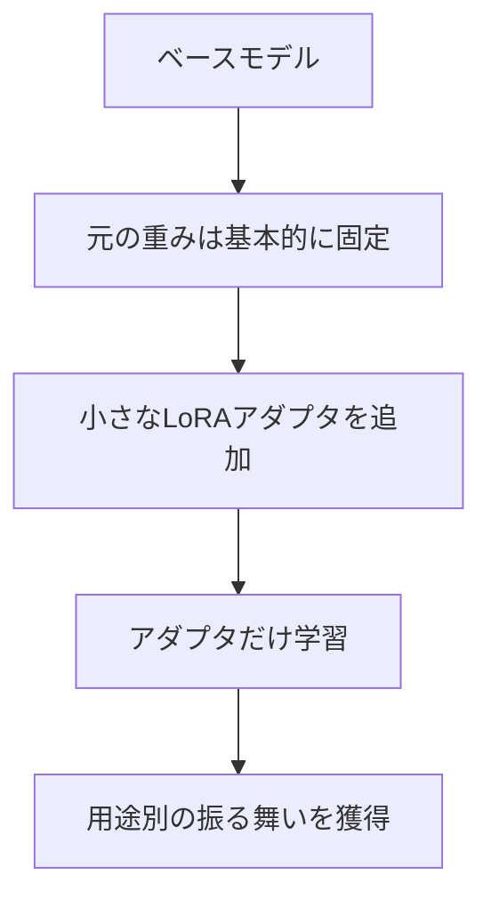

# 第5章 LoRA / QLoRA

## この章で学ぶこと

LoRAとQLoRAは、モデルの重みを一部だけ追加学習して、特定の振る舞いを安定させる方法です。

重要なのは、LoRAを「知識を詰め込む方法」と考えすぎないことです。LoRAが得意なのは、文体、出力形式、分類基準、定型的な変換の安定化です。

## LoRAの直感

通常のファインチューニングでは、モデル全体を更新します。LoRAでは、元のモデルの重みは基本的に固定し、小さな追加部分だけを学習します。



QLoRAは、量子化したモデルにLoRAを組み合わせ、少ないVRAMで学習しやすくする方法です。

## LoRAに向いている用途

一般的な文書作成や確認作業では、次のような用途に向いています。

- コメント文の形式を揃える
- 文書要約のフォーマットを固定する
- 利用者からの質問への回答スタイルを安定させる
- 作業メモを構造化JSONに変換する
- 自由記述アンケートを分類する
- 確認コメント用の観点出しを安定させる

## LoRAに向いていない用途

次のような用途には、LoRAよりRAGが向いています。

- 手順書の内容を大量に覚えさせる
- 最新仕様の知識を覚えさせる
- プロジェクトの全資料を丸暗記させる
- 根拠付きで資料検索させる

知識を更新する必要がある場合は、モデルに覚えさせるより、資料を検索して渡す方がよいです。

## 学習データの形

LoRAでは、入出力ペアを用意します。

```json
{
  "instruction": "以下の文書にコメントを書いてください。",
  "input": "目的は書けているが、手順の説明が結果の繰り返しになっている...",
  "output": "良い点: 目的は明確に書けています。\n改善点: 手順では、結果から何が言えるかを一段深く説明しましょう。\n次回: 観察事実と、自分の解釈を分けて書くと読みやすくなります。"
}
```

よい学習データの条件:

- 出力形式が一貫している
- 文体が揃っている
- 判断基準が明確
- 不適切な断定が少ない
- 入力と出力の対応が自然

最初は大量データより、一貫した100から300件程度のデータを目標にすると扱いやすいです。

Notebook では教材用の小型モデルをゼロから作るのではなく、公開済みの事前学習済みモデルに LoRA adapter を追加し、教材用の入出力ペアで短い supervised fine-tuning を実行します。ベースモデルの重みは固定し、小さな adapter だけを更新し、学習前後の応答、loss、保存された adapter を確認します。

## 評価の観点

LoRA / QLoRA を実施する場合は、導入前後で次の点を比較します。

- 指定した形式を守るか
- 文体が安定しているか
- コメントが厳しすぎたり甘すぎたりしないか
- 根拠のない断定が増えていないか
- 元のモデルの一般能力が落ちていないか

LoRAは、作ること自体よりも評価が難しいです。自分が本当に安定させたい作業を先に決め、その作業に対して評価例を用意することが重要です。

## RAGとの組み合わせ

LoRAとRAGは競合するものではありません。

たとえば、手順書の内容はRAGで参照し、回答の文体や形式はLoRAで安定させる、という組み合わせができます。

```text
RAG: 何を根拠に答えるか
LoRA: どのような形式・文体で答えるか
```

この分担を意識すると、カスタマイズの設計がかなり整理しやすくなります。

