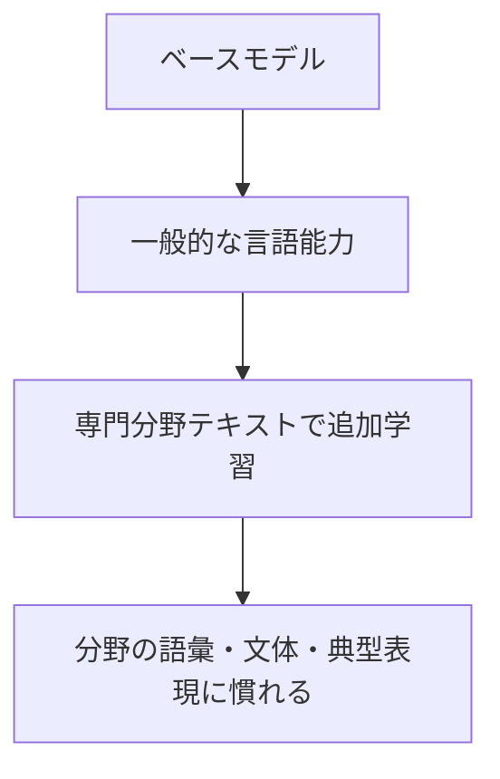

# 第6章 継続事前学習

## この章で学ぶこと

継続事前学習は、学習済みモデルに対して、さらに専門分野の大量テキストを読ませる方法です。

LoRAが「特定の振る舞いを覚えさせる」方法だとすると、継続事前学習は「専門分野の文章や語彙に慣らす」方法です。

## 継続事前学習の位置づけ



これは強力ですが、最初に選ぶ方法ではありません。

理由:

- データ量が必要
- 学習コストが高い
- 評価が難しい
- 過学習や忘却が起こりうる
- ライセンスや個人情報の確認が必要

## 向いている用途

継続事前学習は、次のような目的に向いています。

- 専門分野の論文文体に慣らす
- 分野特有の用語や記法に慣らす
- 研究領域の典型的な問題設定に慣らす
- 日本語の研究指導文体に慣らす
- LaTeXや技術文書の流れに慣らす

ただし、特定の授業資料や論文の内容を根拠付きで扱うなら、継続事前学習よりRAGです。

## 必要なもの

継続事前学習には、少なくとも次の準備が必要です。

- 高品質な専門分野テキスト
- 学習用GPU
- 学習スクリプト
- 評価用データ
- ライセンス確認
- 個人情報や未公開情報の確認

大学研究室では、未公開原稿、学生の文章、共同研究データなどが混ざりやすいので、データ選定には特に注意が必要です。

## いつ検討するべきか

次のような状態になってから検討するのがよいです。

- RAGはすでに動いている
- プロンプト設計も試した
- LoRAで定型タスクの安定化も試した
- それでも専門分野の言い回しや記法に弱い
- 評価用の質問集がある

つまり、継続事前学習は「最初の一歩」ではなく「不足が明確になった後の選択肢」です。

## 失敗しやすい点

継続事前学習でよくある失敗は、目的が曖昧なまま学習を回すことです。

避けたい考え方:

```text
とりあえず研究室の文書を全部読ませれば賢くなるはず。
```

よりよい考え方:

```text
この分野の論文要約で、専門用語の扱いが弱い。
評価質問ではこのタイプの誤りが多い。
その改善を狙って、対象コーパスを選ぶ。
```

評価なしに学習すると、改善したのか、単に雰囲気が変わっただけなのか判断できません。

