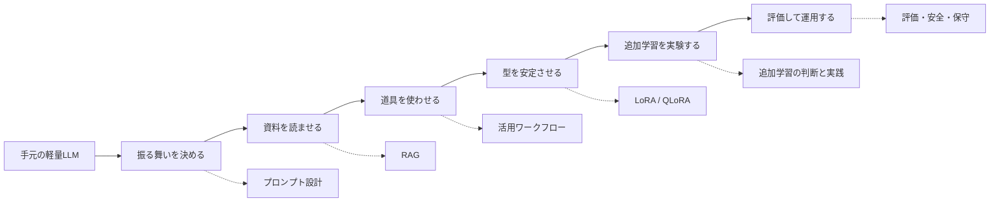

# 軽量ローカルLLMカスタマイズ入門

この教材は、文書作成、コーディング、資料確認などで軽量なローカルLLMを使いこなすための入門ノートです。

ローカルLLMのカスタマイズは、いきなり「自分専用モデルを作る」ことではありません。むしろ最初に大事なのは、モデル、資料、ツール、評価を組み合わせて、自分の文書やコード、確認作業に合った小さな作業場を作ることです。

この教材では、次の順に考えます。



## 章立て

好きな章から読めるように、各章を独立したファイルに分けています。

```text
docs/local-llm-customization/
  README.md
  01-overview.md
  02-prompt-design.md
  03-rag.md
  04-tool-use.md
  05-lora-qlora.md
  06-continued-pretraining.md
  07-evaluation-operation.md
  08-references.md
```

## どこから読むか

全体像をつかみたい場合:

- [第1章 全体像](01-overview.md)

まず自分の作業に使える形を考えたい場合:

- [第2章 プロンプト設計](02-prompt-design.md)
- [第3章 RAG](03-rag.md)

手元の資料を活用したい場合:

- [第3章 RAG](03-rag.md)

Chat UI、API、coding agent、文書やコードのレビューとして使いたい場合:

- [第4章 活用ワークフロー](04-tool-use.md)

コメント文、要約形式、分類タスクを安定させる LoRA 学習を実際に動かしたい場合:

- [第5章 LoRA / QLoRA](05-lora-qlora.md)

活用してみた後に、continued-pretraining 風の追加学習を短く試したい場合:

- [第6章 追加学習の判断と実践](06-continued-pretraining.md)

実運用で事故を減らしたい場合:

- [第7章 評価と運用](07-evaluation-operation.md)

## この教材の読み方

この教材は、日程順ではなく、概念の積み上がり順に並べています。

最初は第1章で地図を見てください。次に、すぐ使うなら第2章と第3章を読みます。その後、Chat UI、API、coding agent、文書やコードのレビューとして使いたいなら第4章へ進みます。モデルの出力を自分の型に寄せる LoRA 学習を実際に動かしたくなったら第5章、実際に使っても残る不足から continued-pretraining 風の追加学習を短く試したくなったら第6章を読んでください。

一番実用的な出発点は、多くの場合これです。

```text
軽量ローカルLLM
+ 文書・コード作業用のシステムプロンプト
+ 手元資料のRAG
+ Chat UI、API、coding agent、文書やコードのレビュー
```

ファインチューニングは最初の目的地ではなく、必要が見えた後に使う二段目の道具として扱うと失敗しにくくなります。

