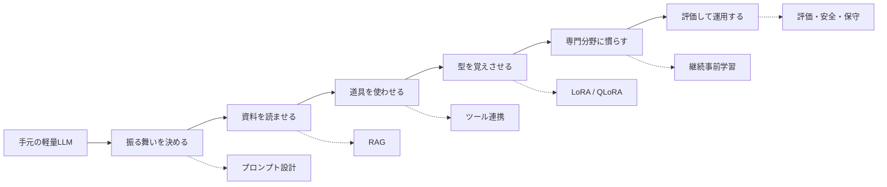

# 軽量ローカルLLMカスタマイズ入門

この教材は、文書作成・コーディング・資料確認で軽量なローカルLLMを使いこなすための入門ノートです。

ローカルLLMのカスタマイズは、いきなり「自分専用モデルを作る」ことではありません。むしろ最初に大事なのは、モデル、資料、ツール、評価を組み合わせて、自分のプロジェクトや説明に合った小さな知的作業場を作ることです。

この教材では、次の順に考えます。



## 章立て

好きな章から読めるように、各章を独立したファイルに分けています。

```text
docs/local-llm-customization/
  README.md
  01-overview.md
  02-prompt-design.md
  03-rag.md
  04-tool-use.md
  05-lora-qlora.md
  06-continued-pretraining.md
  07-evaluation-operation.md
  08-references.md
```

## どこから読むか

全体像をつかみたい場合:

- [第1章 全体像](01-overview.md)

まず自分の文書やコードを扱う日常作業に使える形を考えたい場合:

- [第2章 プロンプト設計](02-prompt-design.md)
- [第3章 RAG](03-rag.md)

手順書、文書、プロジェクトメモを活用したい場合:

- [第3章 RAG](03-rag.md)

CSV、BibTeX、LaTeX、ファイル検索などと組み合わせたい場合:

- [第4章 ツール連携](04-tool-use.md)

コメント文、要約形式、分類タスクを安定させたい場合:

- [第5章 LoRA / QLoRA](05-lora-qlora.md)

専門分野の文体や語彙にモデルを慣らす話を知りたい場合:

- [第6章 継続事前学習](06-continued-pretraining.md)

実運用で事故を減らしたい場合:

- [第7章 評価と運用](07-evaluation-operation.md)

## この教材の読み方

この教材は、日程順ではなく、概念の積み上がり順に並べています。

最初は第1章で地図を見てください。次に、すぐ使うなら第2章と第3章を読みます。その後、実験データや資料管理と組み合わせたいなら第4章へ進みます。モデルの出力を自分の型に寄せたくなったら第5章、さらに専門分野への深い適応に関心が出てきたら第6章を読んでください。

一番実用的な出発点は、多くの場合これです。

```text
軽量ローカルLLM
+ 文書作成・コーディング・資料確認用のシステムプロンプト
+ 手順書・文書・作業メモのRAG
+ Pythonやファイル検索などのツール
```

ファインチューニングは最初の目的地ではなく、必要が見えた後に使う二段目の道具として扱うと失敗しにくくなります。

